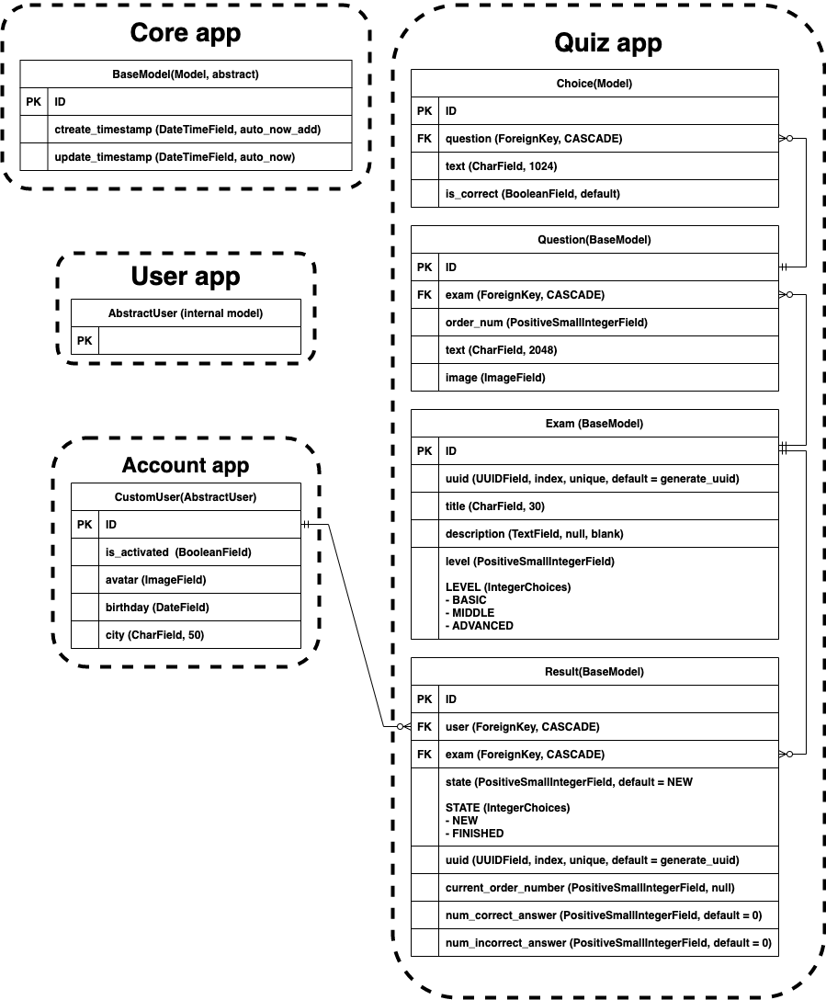

# Технические требования

### Web UI
- Регистрация
    - регистрация
    - авторизация / аутентификация
    - смена пароля
    - сброс пароля
    - профиль
    
- Возможности пользователя
    - прохождение любого теста
    - последовательное проходить вопросы теста (один за другим)
    - завершение отложенного теста
    - удалять отложенный тест
    - просмотр результатов
  
- После завершения теста
    - кол-во правильных / неправильных ответов
    - процент правильных ответов
  
# Админ сайт
- Управление пользователями
- Управление тестами
    - изменить тест
    - добавление нового теста
    - удаление теста
    - валидация теста
      - нельзя сохранить вопрос без указания правильного ответа
      - нельзя сохранить вопрос, в котором все ответы правильные
  
# Доп. требования к проекту
- Проект должен быть выложен на GitHub +
- Наличие файла requirements.txt +
- venv +
- DB --> PostgreSQL
  - миграция DB
- bootstrap5 +
- API
  - unit tests
  
- Кэширование + планировщик
- Упаковка в Docker и запуск на AWS
---
DB Struct

